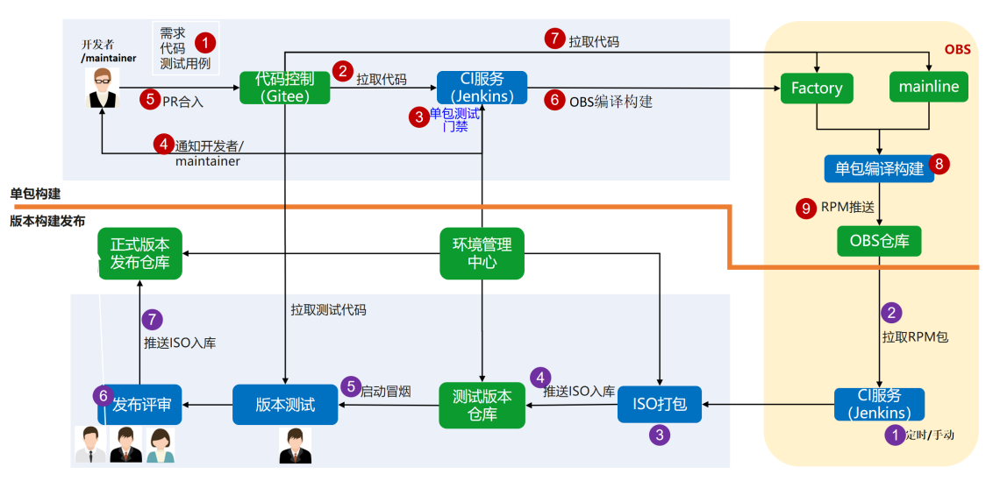
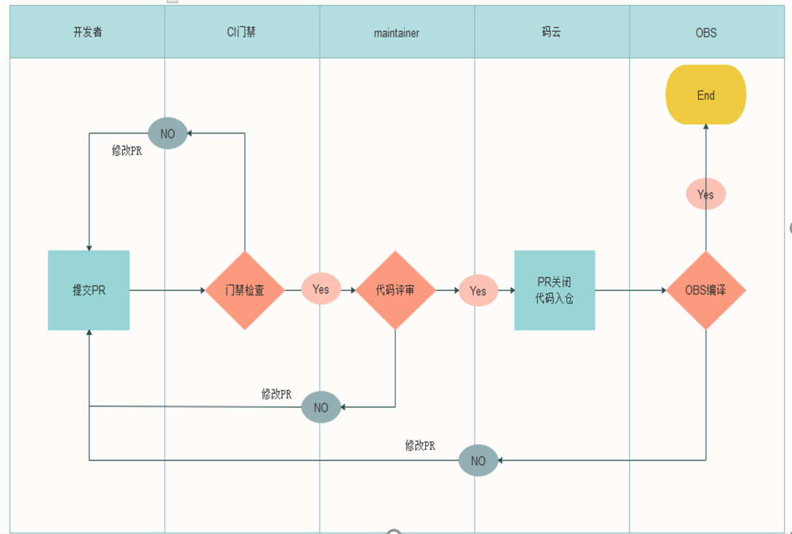
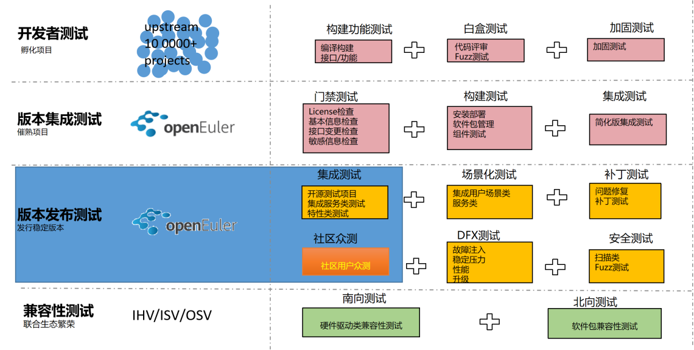
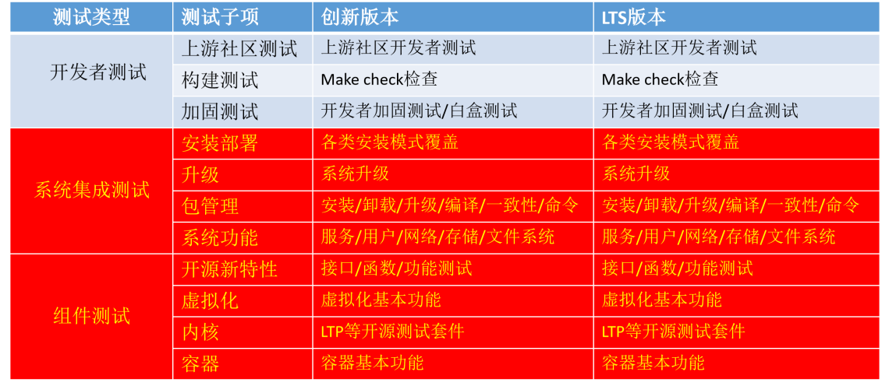

#  ORSP004 openEuler RISC-V 开发版本暂定发版测试流程（名称暂定）

## Meta info

提议者：周嘉诚、罗云翔、席静、吴伟

时间：2022-05-09

## 背景 / Background

openEuler RISC-V 一定程度上已经建立自动化构建基础设施，但开发版本的发版流程目前尚未完全确立。测试组及其他下游用户目前无法对新版本发布时间以及存留时间等基础要素作出估计和预期。

## 问题 / Issues

1. openEuler RISC-V 目前已发布开发版本较少，开发/测试组采用多种来源不一、更新时间不同的软件源进行测试，出现的问题难以复现，且随着软件包来源不同而不同。

## 提议 / Proposal

1. openEuler RISC-V SIG 与 TARSIER 团队根据使用需要共同确立 openEuler RISC-V 开发版本的发版流程。
2. 参照其他发行版的实行方式，openEuler RISC-V 将根据软件包来源及稳定性差异面向不同用户提供多个差异化版本的构建，在第一个大版本发布之前的过渡周期暂时提供其中实时滚动、预发布大版本两个分支的开发版本构建
3. 开发版本构建的内容需要包括快照镜像、对应的软件仓库快照和其他所需文件。
4. 构建基础设施在过渡阶段将每特定周期为 QEMU、Allwinner Nezha/D1、HiFive Unmatched 和 VisionFive V1 四个对象提供构建；暂定每日提供一个实时滚动版本的构建，每周提供一个预发布大版本的构建。
5. 测试团队可利用上述自动化构建进行测试并在指定时间内提供所需反馈到协商预定位置。反馈维护/存放位置暂定为 Gitee Issue.
6. 因存储空间有限，已发布的开发版本构建将会在保留一定周期后移除，让位于新的构建。暂定实时滚动构建保留两个月，预发布大版本构建保留四个月或直到新的大版本发布。下游测试所需时间超过保留期限时，基础设施维护者负责延长保留期限。
7. 相关权责信息在 gitee:openEuler/RISC-V 仓库中进行维护。

## 时间线 / Timeline

2022-05-10: 构建基础设施正式提供过渡阶段两个分支的构建，对外开放同步到至少一个下游。（周嘉诚）

2022-06-01: 待定

## 资源 / Resources

- openEuler RISC-V SIG 负责方向及路线规划、与 openEuler 各 SIG 进行沟通协调。

- 中国科学院软件研究所 Tarsier 团队投入不少于 600 人月及必要的硬件资源。

附《openEuler RISC-V操作系统发行版测试流程》

---

# openEuler RISC-V操作系统发行版测试流程

注：移植和测试流程图参考openEuler Q&A团队报告进行修改和标注。

## 概述

本文档用于规范openEuler RISC-V操作系统发行版的测试和缺陷修复过程。从单包级和版本级两个维度介绍openEuler RISC-V如何进行测试和缺陷修复。

图1. 版本构建&测试&发布全流程

## 移植

移植的任务是完成包构建，解决依赖，产出可用的操作系统发行版镜像和软件源，包移植过程如图2。

图2. 移植流程

移植用于提交测试的产出包括测试目的（简单文字描述），测试系统镜像（应提供版本号），测试软件源（应停止更新），测试软件（提供版本号），负责缺陷修复人员姓名。

## 测试

测试的任务是测试组基于可用的系统镜像和软件源，完成系统测试和软件集成测试，组织众测完成软件单元测试。测试应获得必要的输入，包括测试目的，测试系统镜像（应提供版本号），测试软件源（应停止更新），测试软件（提供版本号），负责缺陷修复人员姓名。测试组应完成测试方案（测试内容，发放给众测平台），测试用例（收集众测提交测试用例），软件缺陷（收集众测提交缺陷报告，验证后提交到issue或Bugzilla，包括缺陷内容、系统镜像版本号、软件版本号等）。

测试组当前的工作重点是面向操作系统版本发布的集成测试和主要的社区众测，见下图蓝色部分。

图3. 测试

系统集成测试包括发行版镜像预装软件的安装和升级，包管理和系统功能。系统集成测试由测试组完成。组件测试包括主要软件的测试包括Xfce桌面环境、Firefox浏览器、LibreOffice办公条件等，内核，容器（docker），虚拟化和新特性（软件）的测试。组件测试使用众测，测试组负责编写测试方案，收集和评审测试报告（用例、缺陷），复现验证缺陷，并将缺陷反馈给开发人员（issue或Bugzilla），如下图红色部分。

图4. 内容测试策略

表1是近期将进入测试Xfce和Firefox的测试目标、策略和进入测试的要求。测试组根据测试策略编写测试内容，包括安装步骤和软件基本功能测试要求。

表1. Xfce和Firefox测试

| **测试需求** | **测试策略**                                               | **输入**                                                     |
| ------------ | ---------------------------------------------------------- | ------------------------------------------------------------ |
| 支持Xfce桌面 | 验证Xfce桌面系统在openEuler RISC-V版本上的可安装和基本功能 | 输入包括系统镜像，软件源，软件版本号，安装步骤文档。其中测试系统镜像，测试软件源，软件版本号应在测试周期停止变化，软件如有变化应变更版本号。 |
| 支持Firefox  | 验证Firefox在openEuler  RISC-V版本上的可安装和基本功能     | 同上                                                         |

## 缺陷修复

缺陷修改工作由移植开发人员负责，工作内容是修复测试复现的缺陷，完成后使用issue或Bugzilla将安装步骤和资源反馈给测试人员，等待测试人员验证成功后，更新issue或Bugzilla状态，同时提交PR进行项目合并。