# openEuler RISC-V RVLab测试 

RVLab是Tasier开发团队为openEuler RISC-V爱好者提供的一个远程openEuler RISC-V使用环境，提供基于公钥的SSH终端和VNC桌面访问。远程实验环境基于独立的RISC-V开发板（D1，Visionfive, Unmatched）搭建，操作系统和软件运行速度较QEMU环境流畅。


预计测试结果：远程SSH成功，远程VNC访问Xfce桌面成功。

实际测试结果：远程SSH成功，远程VNC访问Xfce桌面成功。

## 1. 提交公钥到github

### 1.1 安装git

```bash
sudo apt install git -y  #Ubuntu
yum install git          #Fedora
```

### 1.2 生成密钥

```bash
ssh-keygen
```

### 1.3 拷贝公钥

```bash
cd ~/.ssh
cat id_rsa.pub 
```

拷贝公钥

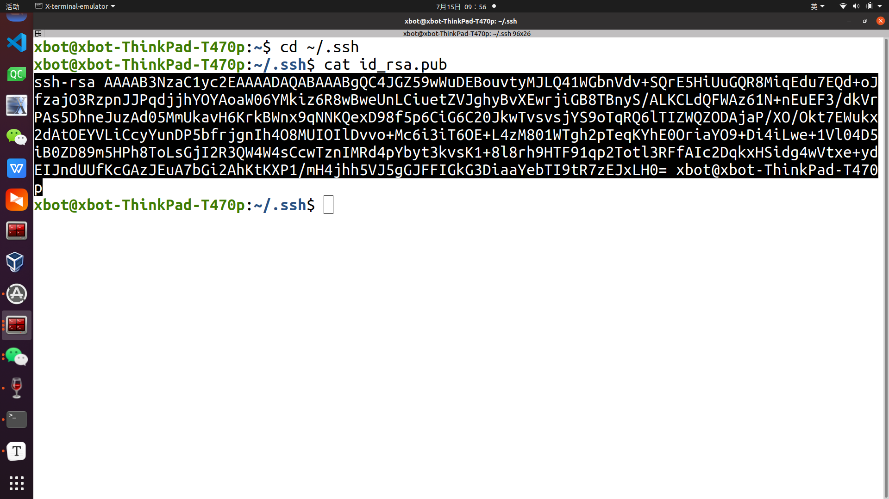

### 1.4 登陆https://github.com/

### 1.5 github添加ssh key

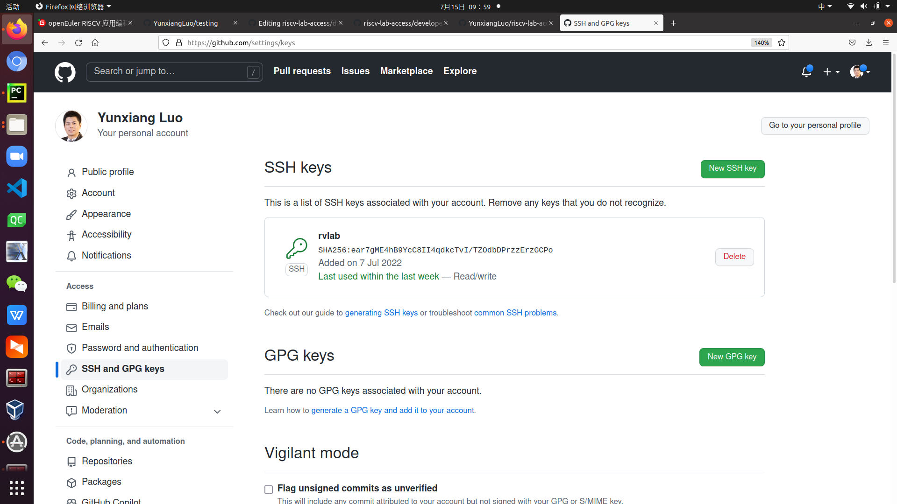

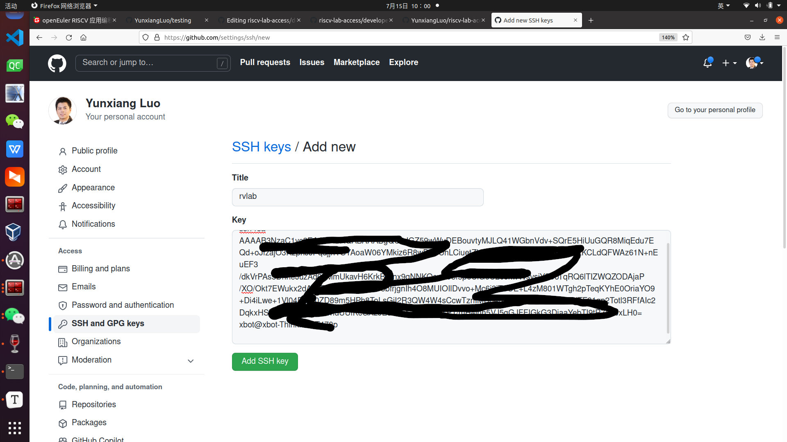

## 2. 申请RVLab用户

申请访问lab.rvperf.org的账号

### 2.1 打开https://github.com/plctlab/riscv-lab-access/blob/main/developers.list


### 2.2 添加自己的github用户id到developers.list

- 例如我的用户id是YunxiangLuo

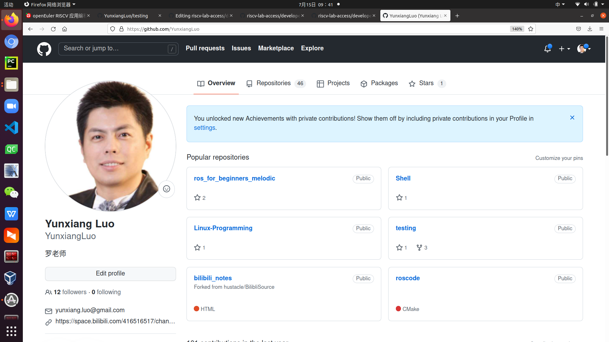

- 编辑developers.list，添加YunxiangLuo

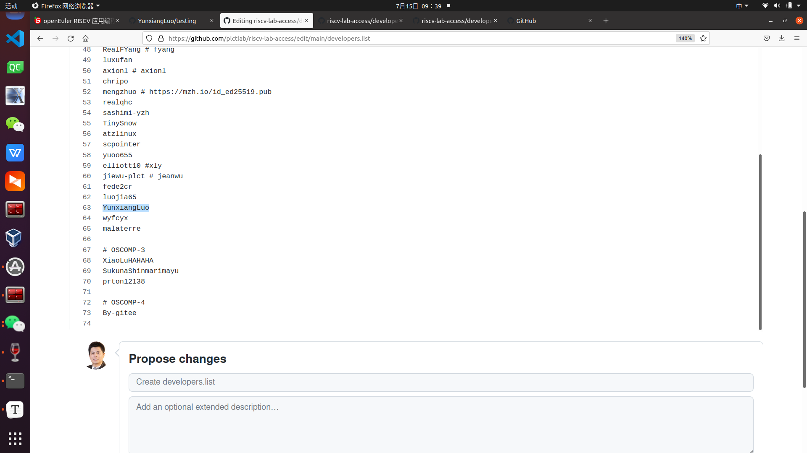

- 确认修改

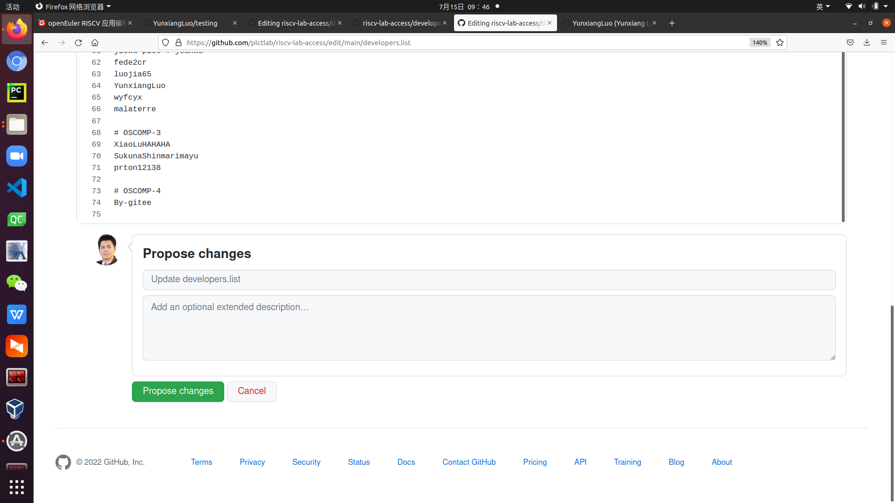

### 2.3 创建PR


- 提交PR

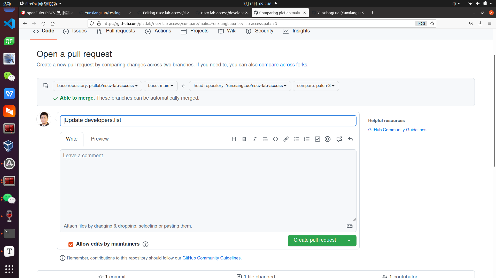

### 2.4 检查PR是否通过

- 到微信群发消息给管理员，申请通过rvlab访问用户添加，查看github PR是否通过

## 3. 本地配置

创建和编辑`~/.ssh/config `

```
vim ~/.ssh/config 
```

填入如下内容，用户名以yunxiangluo为例（为YunxiangLuo的小写yunxiangluo），用户可以使用自己的用户github id替换

```
Host rvlab
HostName lab.rvperf.org
Port 22
User yunxiangluo
```

## 4. SSH访问

### 4.1 SSH连接测试

- 运行远端uptime命令

```bash
ssh rvlab uptime
```

### 4.2 SSH连接

```bash
ssh rvlab
```

## 5. 创建端口映射

### 5.1 获取RVLab vnc配置信息和RISC-V openEuler账号

微信群里询问

### 5.2 本地安装vnc客户端

```bash
sudo apt-get install tigervnc-viewer -y
```

### 创建端口映射

- 假定收到信息为端口5902是为你创建的vnc端口，执行以下命令创建远程与本地5902端口的映射

```bash
ssh -L 0.0.0.0:5902:localhost:5902 yunxiangluo@lab.rvperf.org
```

## 6. VNC访问

### 6.1 启动vnc客户端TigerVnc-Viewer

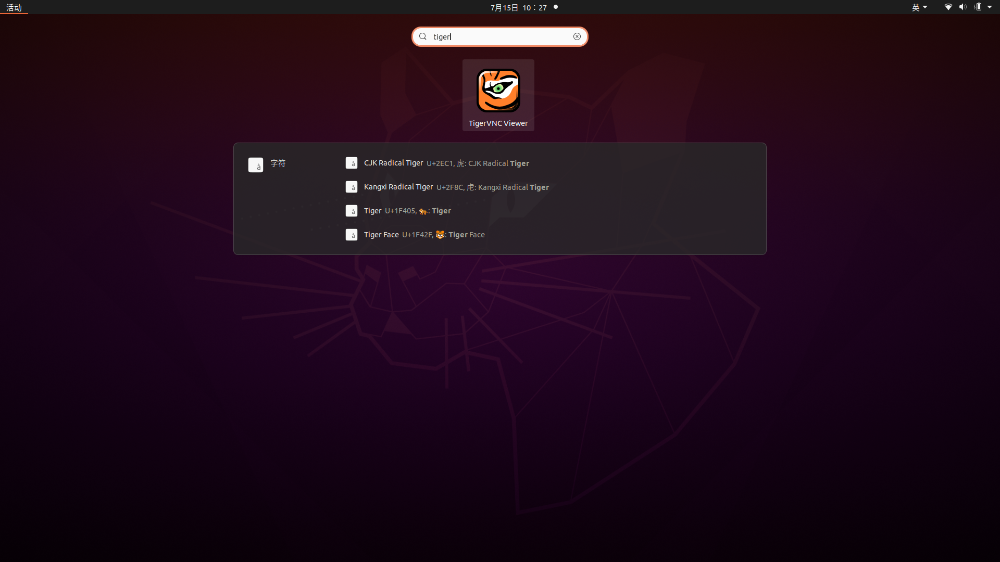

### 6.2 填写地址和端口

- localhost:5902

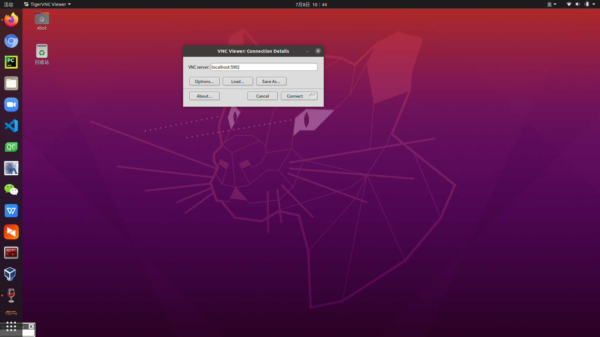

- 输入vnc密码

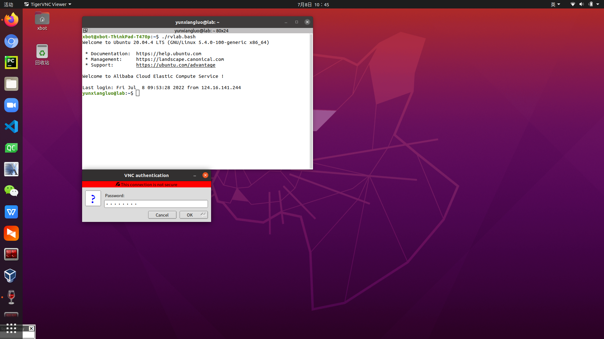

- Xfce输入openEuler用户名和密码

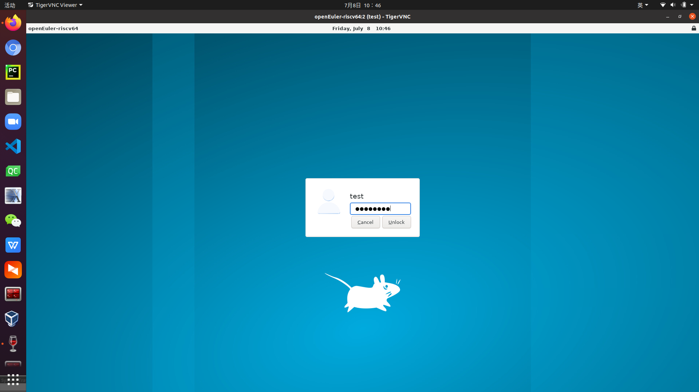

- 测试软件

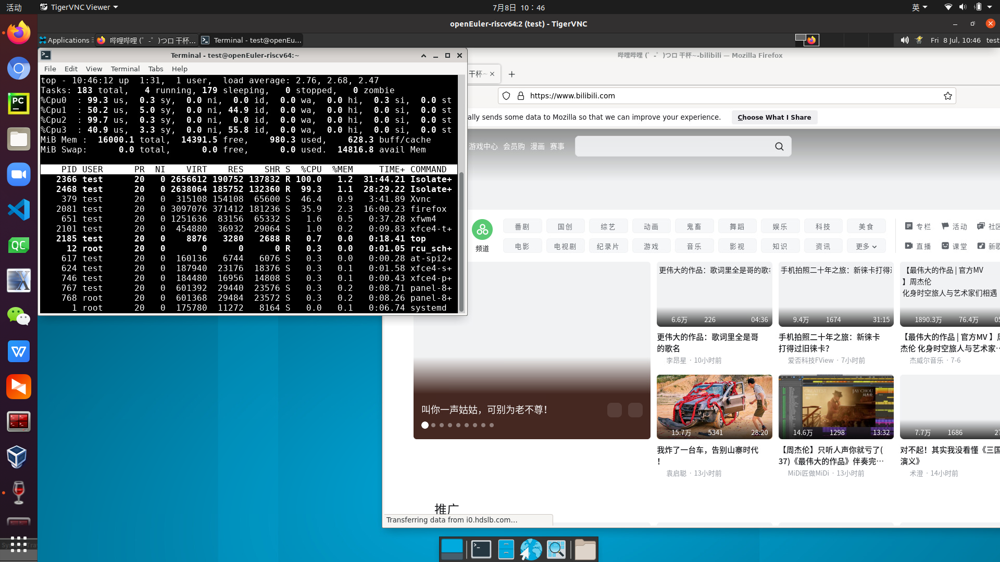